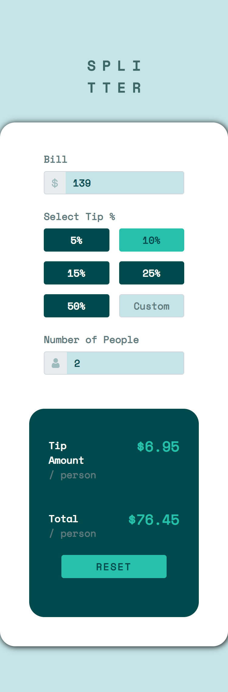

# Frontend Mentor - Tip calculator app solution

This is a solution to the [Tip calculator app challenge on Frontend Mentor](https://www.frontendmentor.io/challenges/tip-calculator-app-ugJNGbJUX). Frontend Mentor challenges help you improve your coding skills by building realistic projects.

## Table of contents

- [Overview](#overview)
  - [The challenge](#the-challenge)
  - [Screenshot](#screenshot)
  - [Links](#links)
- [My process](#my-process)
  - [Built with](#built-with)
  - [What I learned](#what-i-learned)
  - [Useful resources](#useful-resources)
- [Author](#author)
- [Vue setup](#project-setup)

## Overview

### The challenge

Users should be able to:

- View the optimal layout for the app depending on their device's screen size
- See hover states for all interactive elements on the page
- Calculate the correct tip and total cost of the bill per person

### Screenshot



### Links

- Live Site URL: [Netlify](https://objective-kirch-71f420.netlify.app)

## My process

### Built with

- [Bootstrap 5](https://getbootstrap.com)
- [Vue 3](https://v3.vuejs.org)
- Semantic HTML5 markup
- CSS custom properties

### What I learned

In my opinion I have learned so much during this challenge. I had to rewrite the JavaScript part of the app a few times because I had discovered new things that could be applied. The challenge showed me another viewpoint on designing as it contains many different CSS selectors and custom styles. It was a really good practice.

### Useful resources

- [Deploying Vue App](https://www.youtube.com/watch?v=qduayAPJK9A) - This helped me because I didn't know how to deploy a Vue app and I will use it going forward.

## Author

- Frontend Mentor - [@Fall1nglight](https://www.frontendmentor.io/profile/Fall1nglight)

## Project setup

```
npm install
```

### Compiles and hot-reloads for development

```
npm run serve
```

### Compiles and minifies for production

```
npm run build
```
